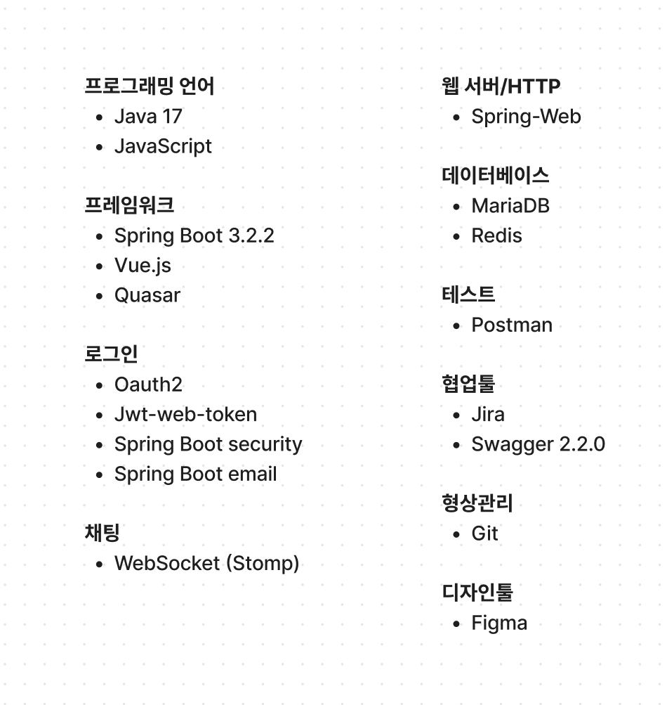

# 프로젝트명 : encore SPACE 


# 프로젝트 개요 : 엔코아 부트캠프홍보를 위해 수강생들의 활동 기록을 통합하여 관리할 수 있는 서비스


# ERD 다이어그램


# 요구사항 정의서(기능명세)


# 스웨거를 활용한 API설계
<details>
    <summary>스페이스</summary>


</details>


<details>
    <summary>스케쥴, 채팅룸</summary>


</details>

<details>
    <summary>게시판 API</summary>


</details>

<details>
    <summary> 회원</summary>


</details>

<details>
    <summary> 좋아요, 댓글 파일</summary>


</details>

<details>
    <summary> CommonResponse </summary>


</details>


# 중점기술명세



# 프로젝트 관리(지라)
<details>
    <summary> 지라를 활용(2) </summary>


</details>

<details>
    <summary> 지라를 활용(2) </summary>


</details>

# 개별 작업 발표

# ✅ 메시지 서비스 (신재석)

## 1. 구현한 기능

- 다대다 채팅
- 채팅방 생성과 구독
- 메시지 송수신

<br/>

---

<br/>

## 2. 기반 기술 설명

<br/>

### 2.1. 웹소켓

- HTTP 환경에서 클라이언트와 서버 사이에서 하나의 TCP 연결을 통해 실시간 양방향 통신을 가능하게 하는 프로토콜
- 웹소켓 기술이 없을 때는 Polling 또는 Long Polling 등의 방식으로 실시간 통신에 가깝게 구현해서 해결함
- 경우에 따라서 웹소켓 통신을 지원하지 않는 브라우저는 Polling 또는 Long Polling 등의 방식으로 양방향 통신을 함.

<br/>

### 2.2. 웹소켓 동작 방식

- 웹소켓은 또다른 프로토콜이지만, HTTP 환경에서 최초에는 TCP 연결을 통해서 Upgrade 되는 방식
- 웹소켓은 연결을 수립하기 위해서 Upgrade헤더와 Connection헤더를 포함하는 HTTP요청을 최초에 보낸다.

<p align="center">
    
</p>

- 상태코드: `101 Switching Protocols`
    - handshake 요청 이후부터 웹소켓 통신이 가능해진다.
    - handshake 과정을 통해서 연결이 수립되면 HTTP에서 웹소켓으로 업그레이드 된다.

<br/>

### 2.3. HTTP vs 웹소켓

- 첫 연결의 시작은 HTTP 요청이 들어가지만, HTTP와 웹소켓 두 프로토콜은 다르게 동작한다.
- HTTP는 클라이언트와 서버간의 접속을 유지하지 않고, Response와 Request 형태의 단방향 통신만 가능하다.
- 따라서 서버에서 클라이언트로의 요청은 불가능하다. 또한 Request와 Response가 완료되면 해당 연결은 종료되는 특징을 가지고 있다.
    - 실시간으로 서버와 클라이언트 간의 통신이 이루어져야 하는 채팅 프로그램 상에서는 적절하지 않을 수 있다.
- 한편, 웹소켓은 클라이언트와 서버 간의 접속이 유지되고, 요청과 응답이 아닌 서로 데이터를 주고 받는 형식이다.

<br/>

---

<br/>

## 3. 스프링 환경에서 웹소켓 사용하기

<p align="center">
  
</p>

- 앞에서 설명한 웹소켓만을 사용해서 채팅을 구현하게 되면 고려해야 할 사항이 많아진다.
- 웹소켓은 메시지 형식이 정해져 있지 않기 때문에 해당 메시지가 어떤 요청인지, 어떤 포맷으로 오는지 등에 대해서 일일이 구현하는 작업이 필요하다.
- STOMP는 웹소켓의 서브 프로토콜로 클라이언트와 서버가 서로 통신할 때 메시지의 형식, 유형, 내용 등을 정의해주는 프로토콜이다.
- STOMP를 사용하게 되면 규격화된 메시지를 보낼 수 있고, 스프링 자체에서도 `spring-messaging`과 `spring-websocket` 모듈을 통해서 웹소켓을 지원하고 있다.

<br/>

### 3.1. STOMP frame 예시

```
COMMAND
header1:value1
header2:value2

Body^@
```

- STOMP는 위와 같은 형식으로 HTTP 위에 올라가는 Frame으로 모델링된다.
- COMMAND로는 주로 SEND, SUBSCRIBE 명령을 사용
- `key:value` 형태로 메시지의 수신대상과 메시지에 대한 정보를 설명
- 그리고 이를 통해서 Publisher(송신)와 Subscriber(수신)를 지정하고, 메시지 브로커를 통해 특정 사용자에게 메시지를 전송하는 기능 등이 가능하게 한다.
- 메시지 브로커는 Publisher로부터 받은 메시지를 Subscriber로 전달해주는 중간 매개체의 역할을 한다.

<br/>

### 3.2. Publish / Subscribe

<p align="center">
  
</p>

- 2명의 사용자 클라이언트가 있고, 사용자는 서버와 웹소켓으로 연결
- 구독하는 주소를 동일하게 `no01`에 구독하도록 설정
- **발행자**의 메시지 타겟을 `no01`으로 설정해서 메시지를 보내고, 서버에서는 발행자의 메시지를 확인한 후 `no01` 채널을 구독하는 모든 사용자에게 메시지를 보내게 됨.

<p align="center">
  
</p>

- 구독 URL이 다르다면?
- 발행자가 메시지 타겟을 `no01`로 설정해서 메시지를 보냈을 때 `no02`를 구독 중인 사용자는 해당 메시지를 받지 못한다.

<p align="center">
  
</p>

- 한편 구독과 발행을 동시에 하는 것도 가능(e.g., 채팅)
- 채팅은 양방향으로 채팅 메시지를 주고 받아야 한다.
- 참고)

<br/>

---

<br/>

## 4. 구현 내용

<br/>

### 4.1. WebSocket 연결을 요청할 주소 설정

```java
@Configuration
@EnableWebSocketMessageBroker
public class WebSocketConfig implements WebSocketMessageBrokerConfigurer {

    @Override
    public void configureMessageBroker(MessageBrokerRegistry registry) {

        // 클라이언트가 구독할 수 있는 endpoint의 접두사를 설정합니다.
        // 구독은 클라이언트가 서버로부터 메시지를 받기 위해 사용됩니다.
        // SimpMessagingTemplate의 convertAndSend() 메소드는 이 endpoint를 사용하여 메시지를 전송,
        // 구독하고 있는 모든 클라이언트가 이 메시지를 받게 됩니다.
        registry.enableSimpleBroker("/sub");

        // 클라이언트에서 메시지를 보내는 데 사용되는 endpoint의 접두사를 설정합니다.
        // 클라이언트는 이 접두사를 사용하여 메시지를 보내며, 이 메시지는 @MessageMapping으로 어노테이션이 달린 컨트롤러 메소드에 전달됩니다.
        registry.setApplicationDestinationPrefixes("/pub");
    }

    @Override
    public void registerStompEndpoints(StompEndpointRegistry registry) {
        registry.addEndpoint("/ws")
                .setAllowedOriginPatterns("*")
                .withSockJS();
    }
}
```

- `EnableWebSocketMessageBroker`로 WebSocket 메시지 처리를 활성화
- `configureMessageBroker()`
    - 인메모리 기반의 SimpleMessageBroker를 활성화
- `registry.enableSimpleBroker("/sub");` : `/sub`으로 시작하는 주소의 Subscriber들에게 메시지를 전달하는 역할
- `registry.setApplicationDestinationPrefixes("/pub");` : 클라이언트는 `/pub`으로 시작하는 주소로 메시지를 보내고, 해당 메시지는 `@MessageMapping`으로 어노테이션이 달린 컨트롤러 메서드에 전달된다.
- `registerStompEndpoints`
    - HandShake로 통신을 담당할 endpoint.
    - 클라이언트에서 서버로 웹소켓 연결을 할 때 `/ws`로 요청을 보낸다.

<br/>

### 4.2. 채팅 데이터 DTO

- 메시지를 전송 및 DB에 저장할 때는 채팅 데이터를 아래의 DTO에 담아서 사용합니다.

```java
package com.encore.space.domain.chat.dto;

import com.encore.space.domain.chat.domain.Chat;
import java.time.format.DateTimeFormatter;
import lombok.AllArgsConstructor;
import lombok.Data;
import lombok.NoArgsConstructor;

@Data
@AllArgsConstructor
@NoArgsConstructor
public class ChatResDto {
    private Long id;
    private String messageType;
    private String roomId;
    private String sender;
    private String message;
    private String time;

    public static ChatResDto convertToDto(Chat chat) {
        DateTimeFormatter formatter = DateTimeFormatter.ofPattern("yyyy/MM/dd hh:mm");
        String formatedNow = chat.getSendAt().format(formatter);
        return new ChatResDto(
                chat.getId(),
                chat.getMessageType().toString(),
                chat.getChatroom().getRoomId(),
                chat.getSender(),
                chat.getMessage(),
                formatedNow);
    }
}
```

<br/>

### 4.3. Controller

```java
@Tag(name = "웹소켓 통신을 위한 API")
@Slf4j
@RequiredArgsConstructor
@RestController
public class ChatController {

    private final SimpMessagingTemplate simpMessagingTemplate;
    private final MemberService memberService;
    private final ChatService chatService;
    private final ChatRoomService chatRoomService;
    private final MemberChatRoomService memberChatRoomService;

    ...
  
    @Operation(
            summary = "메시지 전송 및 DB 저장",
            description = "구독 중인 채팅룸으로 메시지를 전송과 동시에 DB에 채팅 메시지를 저장"
    )
    @MessageMapping("/chat/send/{roomId}")
    @SendTo("/sub/chat/send/{roomId}")
    public ChatResDto sendMessage(@DestinationVariable String roomId, ChatReqDto messageData) {
        Chat createdChat = chatService.save(messageData, MessageType.CHAT);
        ChatResDto chatResDto = ChatResDto.convertToDto(createdChat);
        // 받은 메시지를 그대로 다시 전송합니다.
        return chatResDto;
    }
}
```

- `@MessagingMapping` : Client가 SEND할 수 있는 경로
- WebSocketConfig의 `configureMessageBroker`에서 `setApplicationDestinationPrefixes`로 등록한 `/pub`과 MessagingMapping의 경로가 합쳐져서 `/pub/chat/send/{roomId}`로 메시지를 전달한다.
- 따라서, 클라이언트에서 `/pub/chat/send/{roomId}` URL로 메시지를 보내면 해당 roomId를 구독 중인 사용자들에게 메시지를 전달하게 된다.

<br/>

### 4.4. 클라이언트에서 메시지를 송수신

```javascript
initializeWebSocket() {
  const socket = new SockJS('http://localhost:8080/ws'); // 백엔드 WebSocket 엔드포인트 URL
  this.stompClient = Stomp.over(socket);
  this.stompClient.connect({}, (frame) => {
    console.log('WebSocket 연결됨');
    this.stompClient.subscribe('/sub/chat/send/' + this.chatRoomId, (response) => {

      const responseObject = JSON.parse(response.body);

      const receivedMessage = {
        sender: responseObject.sender, // 다른 정보 채널에서 실제 sender 값을 가져옵니다.
        message: responseObject.message
      };

      // 받은 메시지를 채팅목록에 추가
      this.chatMessage.chatList.push(receivedMessage);

    });
  }, (error) => {
    console.error('WebSocket 연결 오류:', error);
  });
}
```

- 채팅방에 참가하면 Stomp.over를 통해서 웹소켓 연결 후 stompClient.subscribe로 해당 채팅룸을 구독한다.

```javascript
sendMessage() {
  if (!this.stompClient || !this.stompClient.connected) {
    console.error('STOMP connection is not established yet.');
    return;
  }
  const messageData = {
    sender: this.loginUser,
    roomId: this.chatRoomId,
    message: this.message
  }
  console.log("Sending Data: ", messageData);

  this.stompClient.send('/pub/chat/send/'+this.chatRoomId, {}, JSON.stringify(messageData));

  this.message = '';
}
```

- Client에서 /pub/chat/send/{chatRoomID} URL로 메시지를 보내면 chatRoomId를 이용해서 메시지를 전송

<br/>

---

<br/>

## 5. 서비스 시연

<br/>
<br/>

##  ✅ 회원가입 및 로그인 서비스 (조경남)

## 1. 구현한 기능

- 이메일 회원 가입 및 로그인
- SMTP 이메일 발송
- oauth2 를 이용한 github, google 자동 회원가입 및 로그인
- JWT + Redis 이용한 로그인 상태 관리

<p align="center">
  
</p>

<br/>

---

<br/>

## 2. 기반 기술 설명

<br/>

### 2.1. JWT

- JSON 웹 토큰(JSON Web Token, JWT, "jot”)은 선택적 서명 및 선택적 암호화를 사용하여 데이터를 만들기 위한 인터넷 표준으로, 페이로드는 몇몇 클레임(claim) 표명(assert)을 처리하는 JSON을 보관하고 있다. 토큰은 비공개 시크릿 키 또는 공개/비공개 키를 사용하여 서명된다

<p align="center">
  
</p>

<br/>

### 2.2. Oauth2

- 플리케이션이 리소스 소유자에게 리소스에 대한 접근 권한을 허용하고, 요청 결과로 전달받은 토큰을 이용해 애플리케이션이 해당 리소스에 접근하는 프로토콜

<br/>

### 2.3. Redis

- 레디스는 Remote Dictionary Server의 약자로서, "키-값" 구조의 비정형 데이터를 저장하고 관리하기 위한 오픈 소스 기반의 비관계형 데이터베이스 관리 시스템으로 인메모리를 사용한다.

<br/>

### 2.4. SMTP

- Simple Mail Transfer Protocol의 약자로, 이메일 전송에 사용되는 네트워크 프로토콜

<br/>

### 2.5. Spring Security

- Spring 기반의 애플리케이션의 보안(인증과 권한, 인가 등)을 담당하는 스프링 하위 프레임워크이다. Spring Security는 '인증'과 '권한'에 대한 부분을 Filter 흐름에 따라 처리하고 있다

<p align="center">
  
</p>

---

<br/>

## 3. 이슈

<br/>


### 3.1. Session vs JWT

### 로그인 요청
#### Data Request is High
| 로그인 방식                                         | 보안   | 서버 부하     | 네트워크 부하 | 성능   |
|---------------------------------------------------|--------|-------------|-------------|--------|
| 세션 기반 인증                                      | 높음   | 매우 높음    | 높음         | 중간   |
| 엑세스 토큰만 사용                                   | 중간   | 중간~높음    | 중간         | 우수   |
| 엑세스 토큰과 리프레시 토큰 사용                     | 우수   | 높음         | 중간~높음    | 중간   |
| 엑세스 토큰은 클라이언트에게 주고 리프레시 토큰은 서버에 저장 | 우수   | 중간~높음    | 중간~높음    | 중간   |
| 엑세스 토큰은 클라이언트에게 주고 리프레시 토큰을 로그인한 클라이언트 IP 정보와 함께 서버에 저장 | 최우수 | 중간~높음 | 중간~높음 | 중간   |

#### Data Request is Low
| 로그인 방식                                         | 보안   | 서버 부하     | 네트워크 부하 | 성능   |
|---------------------------------------------------|--------|-------------|-------------|--------|
| 세션 기반 인증                                      | 높음   | 중간~높음    | 높음         | 중간   |
| 엑세스 토큰만 사용                                   | 중간   | 낮음~중간    | 중간         | 우수   |
| 엑세스 토큰과 리프레시 토큰 사용                     | 우수   | 중간         | 중간~높음    | 중간   |
| 엑세스 토큰은 클라이언트에게 주고 리프레시 토큰은 서버에 저장 | 우수   | 낮음~중간    | 중간~높음    | 중간   |
| 엑세스 토큰은 클라이언트에게 주고 리프레시 토큰을 로그인한 클라이언트 IP 정보와 함께 서버에 저장 | 최우수 | 낮음~중간 | 중간~높음 | 중간   |

### 데이터 요청
#### Data Request is High
| 로그인 방식                                         | 보안   | 서버 부하     | 네트워크 부하 | 성능   |
|---------------------------------------------------|--------|-------------|-------------|--------|
| 세션 기반 인증                                      | 높음   | 매우 높음    | 높음         | 중간   |
| 엑세스 토큰만 사용                                   | 중간   | 중간~높음    | 중간         | 우수   |
| 엑세스 토큰과 리프레시 토큰 사용                     | 우수   | 높음         | 중간~높음    | 중간   |
| 엑세스 토큰은 클라이언트에게 주고 리프레시 토큰은 서버에 저장 | 우수   | 중간~높음    | 중간~높음    | 중간   |
| 엑세스 토큰은 클라이언트에게 주고 리프레시 토큰을 로그인한 클라이언트 IP 정보와 함께 서버에 저장 | 최우수 | 중간~높음 | 중간~높음 | 중간   |

#### Data Request is Low
| 로그인 방식                                         | 보안   | 서버 부하     | 네트워크 부하 | 성능   |
|---------------------------------------------------|--------|-------------|-------------|--------|
| 세션 기반 인증                                      | 높음   | 중간~높음    | 높음         | 중간   |
| 엑세스 토큰만 사용                                   | 중간   | 낮음~중간    | 중간         | 우수   |
| 엑세스 토큰과 리프레시 토큰 사용                     | 우수   | 중간         | 중간~높음    | 중간   |
| 엑세스 토큰은 클라이언트에게 주고 리프레시 토큰은 서버에 저장 | 우수   | 낮음~중간    | 중간~높음    | 중간   |
| 엑세스 토큰은 클라이언트에게 주고 리프레시 토큰을 로그인한 클라이언트 IP 정보와 함께 서버에 저장 | 최우수 | 낮음~중간 | 중간~높음 | 중간   |

<br/>

---

## 4. 구현

<br/>

## 4.1. SecurityConfig


```java
@Configuration
@EnableWebSecurity
@EnableMethodSecurity
public class SecurityConfig {

    private final JwtAuthFilter jwtAuthFilter;
    private final LoginService loginService;
    private final LoginSuccessHandler loginSuccessHandler;
    private final LoginFailureHandler loginFailureHandler;
    private final CustomAuthenticationEntryPointHandler customAuthenticationEntryPointHandler;
    private final CustomAccessDeniedHandler customAccessDeniedHandler;


    @Autowired
    public SecurityConfig(
            JwtAuthFilter jwtAuthFilter,
            LoginService loginService,
            LoginSuccessHandler loginSuccessHandler,
            LoginFailureHandler loginFailureHandler,
            CustomAuthenticationEntryPointHandler customAuthenticationEntryPointHandler,
            CustomAccessDeniedHandler customAccessDeniedHandler
    ) {
        this.jwtAuthFilter = jwtAuthFilter;
        this.loginService = loginService;
        this.loginSuccessHandler = loginSuccessHandler;
        this.loginFailureHandler = loginFailureHandler;
        this.customAuthenticationEntryPointHandler = customAuthenticationEntryPointHandler;
        this.customAccessDeniedHandler = customAccessDeniedHandler;
    }

    @Bean
    public PasswordEncoder passwordEncoder(){
        return PasswordEncoderFactories.createDelegatingPasswordEncoder();
    }

    @Bean
    public SecurityFilterChain filterChain(HttpSecurity httpSecurity) throws Exception{
        return httpSecurity
                .csrf(AbstractHttpConfigurer::disable)
                .cors(cors -> cors.configurationSource(CorsConfig.corsConfigurationSource()))
                .formLogin(AbstractHttpConfigurer::disable)
                .httpBasic(AbstractHttpConfigurer::disable)
                .authorizeHttpRequests(authorizeRequest ->
                        authorizeRequest
                                .requestMatchers("/" ).permitAll()
                                .requestMatchers(SwaggerUrl).permitAll()
                                .requestMatchers(MemberApiUrl).permitAll()
                                .requestMatchers(LoginApiUrl).permitAll()
                                .requestMatchers(PostApiUrl).permitAll()
                                .requestMatchers(FileResource).permitAll()
                                .requestMatchers(ManagerApiUrl).hasAnyRole("MANAGER")
                                .anyRequest()
                                .authenticated()

                )

                .sessionManagement((sessionManagement) ->
                        sessionManagement.sessionCreationPolicy(SessionCreationPolicy.STATELESS)
                )

                .addFilterBefore(jwtAuthFilter, UsernamePasswordAuthenticationFilter.class)

                .oauth2Login((oauth2) -> oauth2
                        .userInfoEndpoint(userInfoEndpoint -> userInfoEndpoint
                                .userService(loginService)
                        )
                        .successHandler(loginSuccessHandler)
                        .failureHandler(loginFailureHandler)
                )

                .exceptionHandling( (exceptionHandling) -> {
                    exceptionHandling.authenticationEntryPoint(customAuthenticationEntryPointHandler);
                    exceptionHandling.accessDeniedHandler(customAccessDeniedHandler);
                })

                .build();
    }

    private static final String[] SwaggerUrl = {
            "/api/vi/auth/**",
            "/swagger-ui/**",
            "/swagger-ui.html",
            "/v3/api-docs/**",
            "/v3/api-docs.yaml"
    };

    private static final String[] MemberApiUrl = {
            "/api/member/login",
            "/api/member/create",
            "/api/member/emailAuthentication",
            "/api/member/emailCheck",
            "/ws/**"
    };

    private static final String[] LoginApiUrl = {

            "/oauth2/**",
            "/login",
    };

    private static final String[] PostApiUrl = {
            "/api/post/list",
            "/PostDetail/**",
    };

    private static final String[] FileResource = {
            "/static/**",
            "/images/**",
            "api/file/images/*/image"
    };

    private static final String[] ManagerApiUrl = {
            "/manager/**",
    };

}

```


## 4.2. LoginService


```java
    @Override
    public OAuth2User loadUser(OAuth2UserRequest userRequest) throws OAuth2AuthenticationException {
        OAuth2UserService<OAuth2UserRequest, OAuth2User> delegate = new DefaultOAuth2UserService();
        OAuth2User oAuth2User = delegate.loadUser(userRequest);
        MemberInfo info = null;

        // google
        if(userRequest.getClientRegistration().getRegistrationId().equals("google")) {
            info = new GoogleMember(oAuth2User.getAttributes());
        }

        // github
        if(userRequest.getClientRegistration().getRegistrationId().equals("github")){
            info = new GitHubMember(oAuth2User.getAttributes(), userRequest.getAccessToken().getTokenValue());
        }

        // 자동 회원가입
        if(info != null && !memberService.existsByEmail(Objects.requireNonNull(info).getEmail())){
            memberService.memberCreate(
                    MemberReqDto.builder()
                            .name(info.getName().equals("null") ? info.getEmail() : info.getName())
                            .email(info.getEmail())
                            .nickname(info.getName().equals("null") ? info.getEmail() : info.getName())
                            .profile(info.getPicture())
                            .loginType(info.getProvider())
                            .build()
            );
        }
        Member member = memberService.findByEmail(Objects.requireNonNull(info).getEmail());

        // LoginSuccessHandler
        Map<String, Object> attributes = new HashMap<>(oAuth2User.getAttributes());
        attributes.put("role", member.getRole());
        attributes.put("email", member.getEmail());


        return new DefaultOAuth2User(
                oAuth2User.getAuthorities(),
                attributes,
                userRequest.getClientRegistration().getProviderDetails()
                        .getUserInfoEndpoint().getUserNameAttributeName()
        );
    }

    // 로그인
    public Object login(LoginReqDto loginReqDto, LoginType loginType) {
        Member member = memberService.findByEmail(loginReqDto.getEmail());

        // sns 회원가입한 사람이 일반 로그인 하려고 할때
        if(member.getPassword() == null && loginType.equals(LoginType.EMAIL)){
            throw new UsernameNotFoundException(
                    "해당 이메일은 "+ member.getLoginType().toString() + "로 로그인 한 계정입니다. \n" +
                            "만일 이메일로 로그인 하고 싶으시다면 패스워드를 설정해주세요."
            );
        }

        // 패스워드 일치 여부
        if(!passwordConfig.passwordEncoder().matches(loginReqDto.getPassword(), member.getPassword())){
            throw new UsernameNotFoundException("비밀번호가 틀렸습니다.");
        }

        HttpServletRequest request = ((ServletRequestAttributes) RequestContextHolder.currentRequestAttributes()).getRequest();
        return jwtProvider.exportToken(member.getEmail(), member.getRole().toString(), webConfig.ipCheck(request));
    }
```

## 4.3. JwtProvider

```java
@Slf4j
@Component
public class JwtProvider {

    @Value("${jwt.accessTokenSecretKey}")
    String accessTokenSecretKey;

    @Value("${jwt.refreshTokenSecretKey}")
    String refreshTokenSecretKey;

    @Value("${jwt.accessTokenTime}")
    int accessTokenTime;

    @Value("${jwt.refreshTokenTime}")
    int refreshTokenTime;

    @Value("${spring.data.redis.host}")
    private String redisHost;

    private final RedisTemplate<String,String> redisTemplate;

    public JwtProvider(RedisTemplate<String, String> redisTemplate) {
        this.redisTemplate = redisTemplate;
    }

    public String createAccessToken(String email,String role){
        Claims claims = Jwts.claims().setSubject(email);
        claims.put("role",role);
        Date now = new Date();

        Key key = Keys.hmacShaKeyFor(accessTokenSecretKey.getBytes(StandardCharsets.UTF_8));

        return Jwts.builder()
                .setClaims(claims)
                .setIssuedAt(now)
                .setExpiration(new Date(now.getTime() + accessTokenTime * 60 * 1000L))
                .signWith( key, SignatureAlgorithm.HS256)
                .compact();
    }

    public String createRefreshToken (String email,String role, String clientIP){
        Claims claims = Jwts.claims().setSubject(email);
        claims.put("role",role);
        claims.put("clientIP", clientIP);
        Date now = new Date();

        Key key = Keys.hmacShaKeyFor(refreshTokenSecretKey.getBytes(StandardCharsets.UTF_8));

        return Jwts.builder()
                .setClaims(claims)
                .setIssuedAt(now)
                .setExpiration(new Date(now.getTime() + refreshTokenTime * 24 * 60 * 60 * 1000L))
                .signWith( key, SignatureAlgorithm.HS512)
                .compact();
    }

    public String extractAccessToken(HttpServletRequest request) {
        String bearerToken = request.getHeader("Authorization");
        if (StringUtils.hasText(bearerToken) && bearerToken.startsWith("Bearer ")) {
            return bearerToken.substring(7);
        }
        return null;
    }

    public Claims validateAccessToken(String token) {
        Key key = Keys.hmacShaKeyFor(accessTokenSecretKey.getBytes(StandardCharsets.UTF_8));
        return Jwts.parserBuilder().
                setSigningKey(key)
                .build()
                .parseClaimsJws(token)
                .getBody();
    }

    public Claims validateRefreshToken(String token) {
        Key key = Keys.hmacShaKeyFor(refreshTokenSecretKey.getBytes(StandardCharsets.UTF_8));
        return Jwts.parserBuilder()
                .setSigningKey(key)
                .build()
                .parseClaimsJws(token)
                .getBody();
    }

    public String exportToken(String email, String role, String clientIP){
        String accessToken = this.createAccessToken(
                email, role
        );

        String refreshToken = this.createRefreshToken(
                email, role, clientIP
        );
        redisTemplate.opsForValue().set(accessToken, refreshToken, refreshTokenTime, TimeUnit.DAYS);


        return accessToken;
    }


    public String reExportToken(String email, String role, String accessToken, String refreshToken){
        String newAccessToken = this.createAccessToken(
                email, role
        );
        Jedis jedis = new Jedis(redisHost, 6379);
        long ttl = jedis.ttl(accessToken);
        redisTemplate.delete(accessToken);
        redisTemplate.opsForValue().set(newAccessToken, refreshToken, ttl, TimeUnit.SECONDS);

        return  newAccessToken;
    }
}

```

## 4.3. LoginSuccessHandler

```java
@Slf4j
@Component
public class LoginSuccessHandler implements AuthenticationSuccessHandler {

    private final ObjectMapper objectMapper;
    private final JwtProvider jwtProvider;
    private final WebConfig webConfig;

    @Autowired
    public LoginSuccessHandler(
            ObjectMapper objectMapper,
            JwtProvider jwtProvider,
            WebConfig webConfig
    ) {
        this.objectMapper = objectMapper;
        this.jwtProvider = jwtProvider;
        this.webConfig = webConfig;
    }

    @Override
    public void onAuthenticationSuccess(HttpServletRequest request, HttpServletResponse response, Authentication authentication) throws IOException, ServletException {
        response.setContentType(MediaType.APPLICATION_JSON_VALUE);
        response.setCharacterEncoding("UTF-8");
        OAuth2User oauth2User = (OAuth2User) authentication.getPrincipal();


        Cookie cookie = new Cookie("accessToken", jwtProvider.exportToken(
                oauth2User.getAttribute("email"),
                Objects.requireNonNull(oauth2User.getAttribute("role")).toString(),
                webConfig.ipCheck(request)));
        cookie.setPath("/"); // 모든 경로에 대해 쿠키 전송
        response.addCookie(cookie);

        String redirectUrl = "http://localhost:8081/oauth2/redirect";

        // 클라이언트로 리다이렉트
        response.setStatus(HttpStatus.FOUND.value());
        response.setHeader(HttpHeaders.LOCATION, redirectUrl);
    }
}

```
## 4.4. JwtAuthFilter

```java
@Slf4j
@Component
public class JwtAuthFilter extends OncePerRequestFilter {

  private final ObjectMapper objectMapper;
  private final JwtProvider jwtProvider;
  private final RedisTemplate<String, String> redisTemplate;
  private final WebConfig webConfig;

  @Autowired
  public JwtAuthFilter(
          ObjectMapper objectMapper,
          JwtProvider jwtProvider,
          RedisTemplate<String, String> redisTemplate,
          WebConfig webConfig
  ) {
    this.objectMapper = objectMapper;
    this.jwtProvider = jwtProvider;
    this.redisTemplate = redisTemplate;
    this.webConfig = webConfig;
  }

  @Override
  protected void doFilterInternal(HttpServletRequest request, HttpServletResponse response, FilterChain filterChain) throws ServletException, IOException {
    try {
      String token = jwtProvider.extractAccessToken(request);
      if (token != null) {
        Claims claims = jwtProvider.validateAccessToken(token);
        if (claims != null) {
          CustomUserDetails customUserDetails = CustomUserDetails.builder()
                  .role(claims.get("role").toString())
                  .username(claims.getSubject())
                  .password("")
                  .build();

          customUserDetails.getAuthorities().add(new SimpleGrantedAuthority("ROLE_" + claims.get("role")));

          UsernamePasswordAuthenticationToken authentication = new UsernamePasswordAuthenticationToken(
                  customUserDetails, null, customUserDetails.getAuthorities()
          );
          SecurityContextHolder.getContext().setAuthentication(authentication);
        }
      }
      filterChain.doFilter(request, response);
    }
    catch (Exception e ){
      String errorMessage = "";
      Object errorException = "";
      if(e instanceof MalformedJwtException){
        errorMessage = "올바르지 않은 토큰입니다.";
        errorException = e.getMessage();
      }
      if(e instanceof ExpiredJwtException){
        errorMessage = "다시 로그인해 주세요.";
        String token =  jwtProvider.extractAccessToken(request);
        String refreshToken = redisTemplate.opsForValue().get(token);
        if(refreshToken != null){
          Claims claims = jwtProvider.validateRefreshToken(refreshToken);
          if(claims.get("clientIP").toString().equals(webConfig.ipCheck(request))){
            errorMessage = "토큰을 재발행 합니다.";
            errorException = jwtProvider.reExportToken(
                    claims.getSubject(),
                    claims.get("role").toString(),
                    token,
                    refreshToken
            );
          }
        }else{
          errorException = "로그인 만료";
        }

      }
      log.error(e.getClass().getName() + " : " + errorMessage);

      response.setContentType(MediaType.APPLICATION_JSON_VALUE);
      response.setCharacterEncoding("UTF-8");
      objectMapper.writeValue(
              response.getWriter(),
              CommonResponse.builder()
                      .httpStatus(HttpStatus.UNAUTHORIZED)
                      .message(errorMessage)
                      .result(errorException)
                      .build()
      );
    }
  }
}
```

<p align="center">
  
</p>


<br/>


---

