# 프로젝트명 : encore SPACE 

# 프로젝트 개요 : 엔코아 부트캠프홍보를 위해 수강생들의 활동 기록을 통합하여 관리할 수 있는 서비스
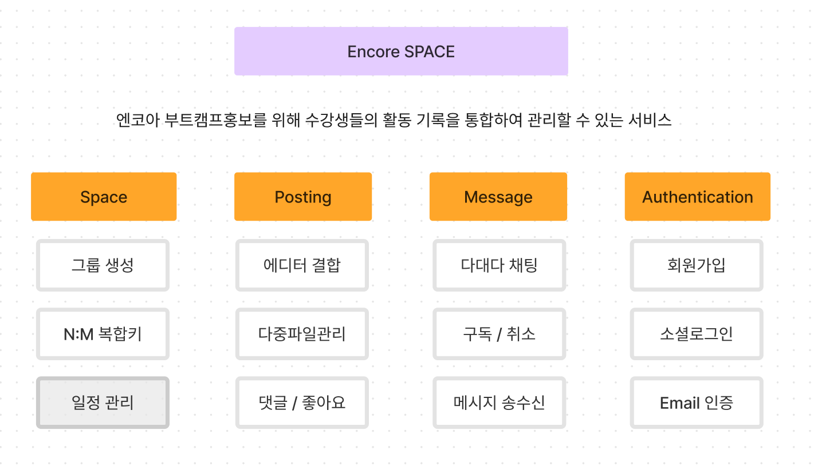

# ERD 다이어그램
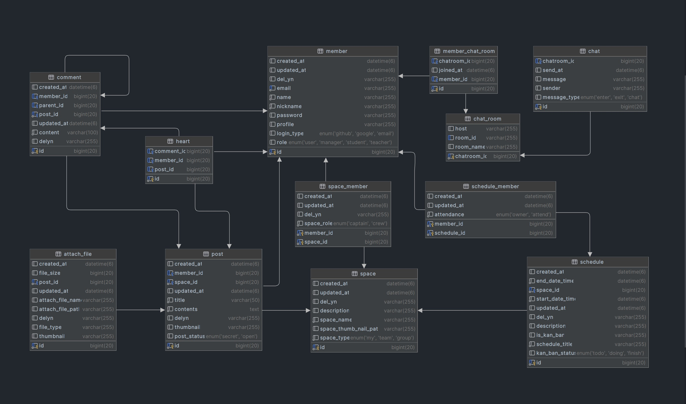

# 요구사항 정의서(기능명세)
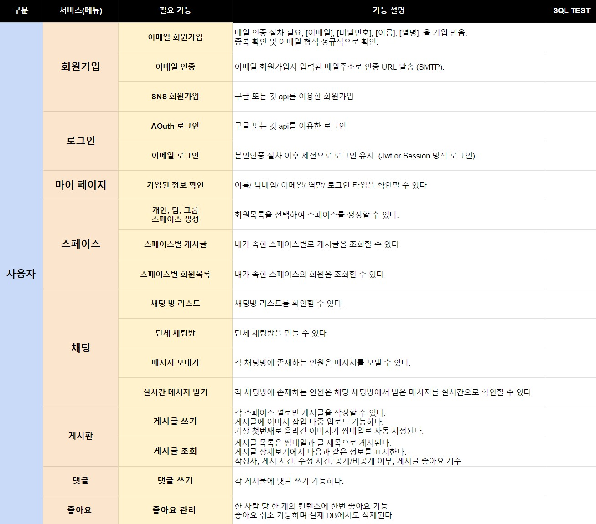

# 스웨거를 활용한 API설계

    
스페이스

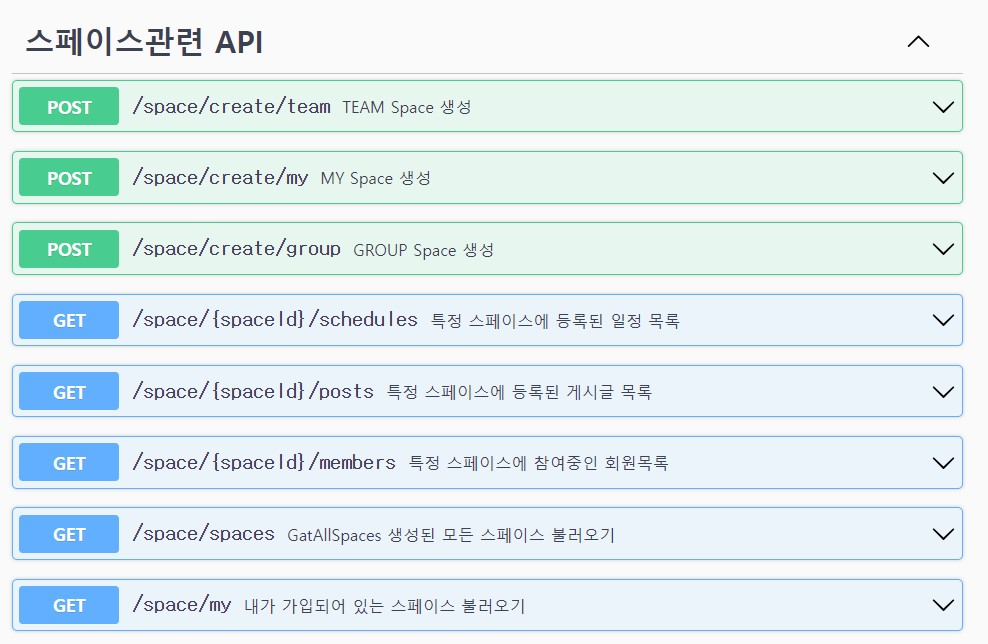

    
스케쥴, 채팅룸

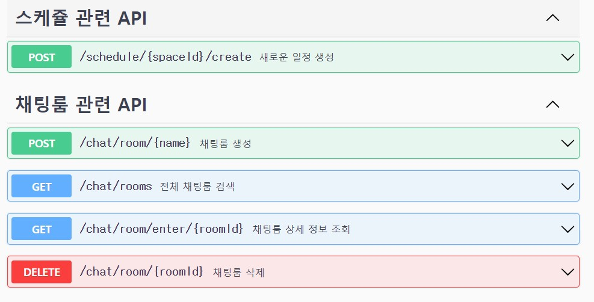

    
게시판 API

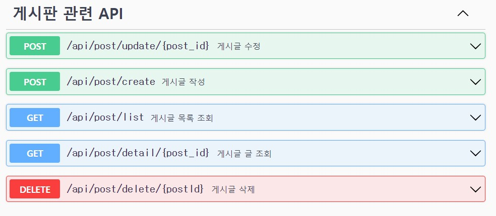

    
 회원

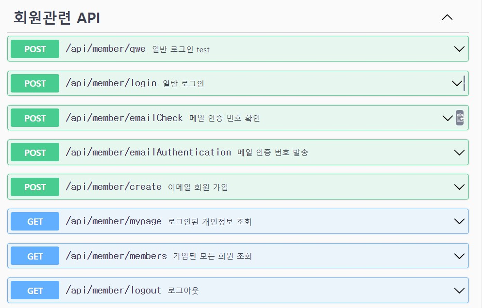

    
 좋아요, 댓글 파일

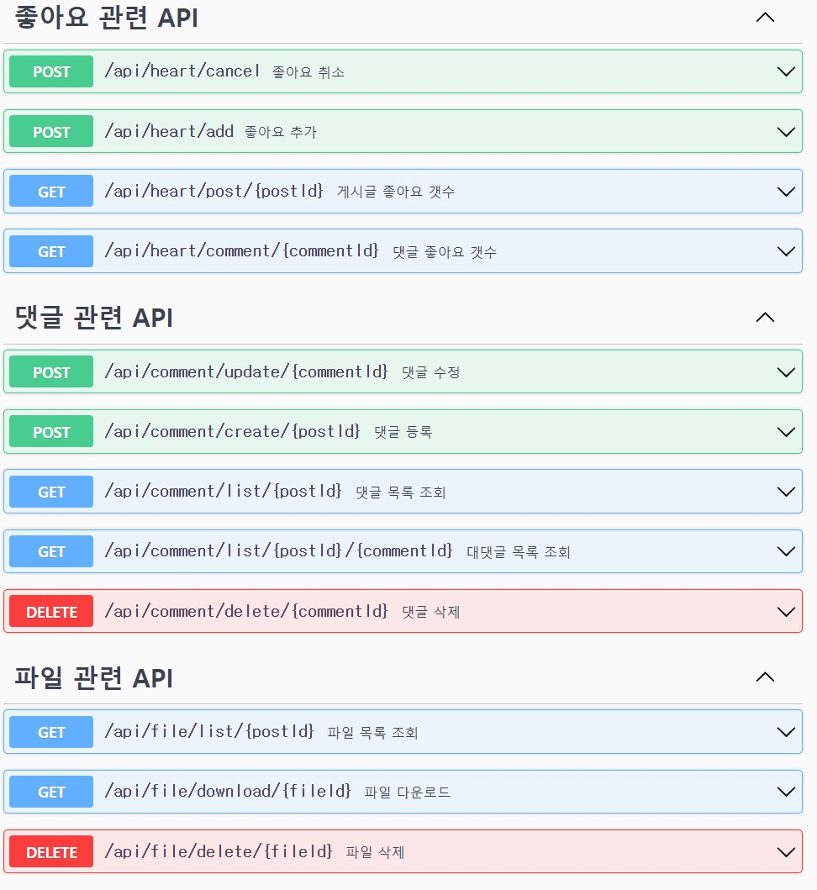

    
 CommonResponse 

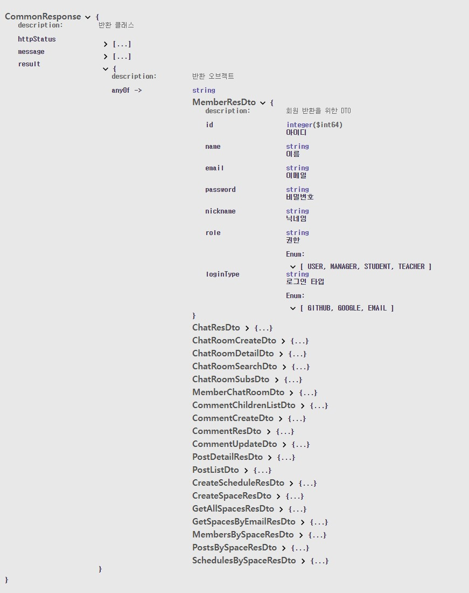

# 중점기술명세

# 프로젝트 관리(지라)

    
 지라를 활용(2) 

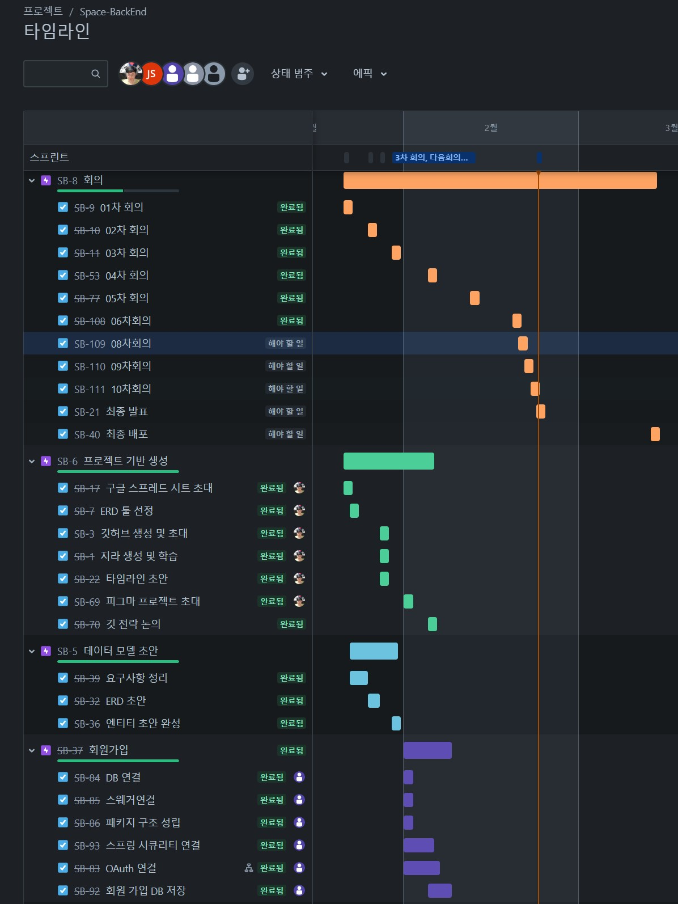

    
 지라를 활용(2) 

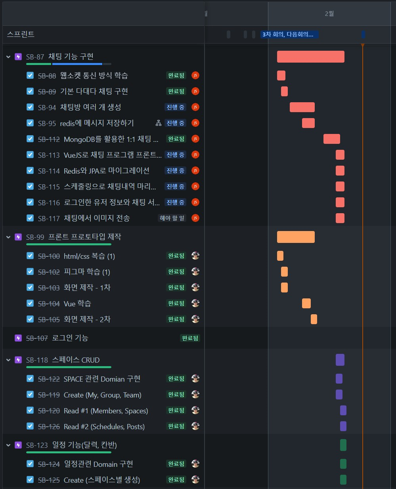
