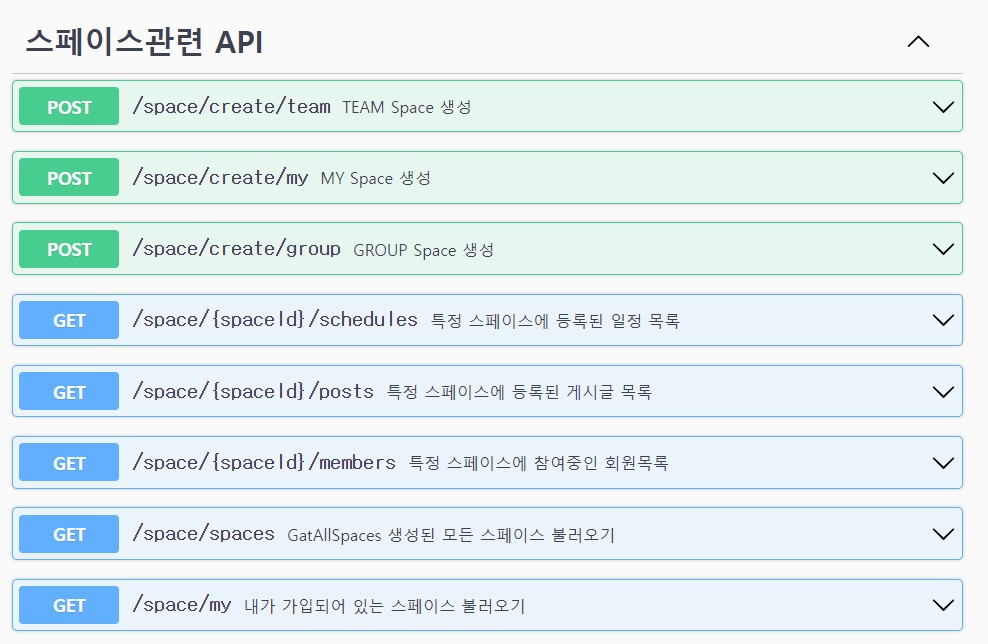
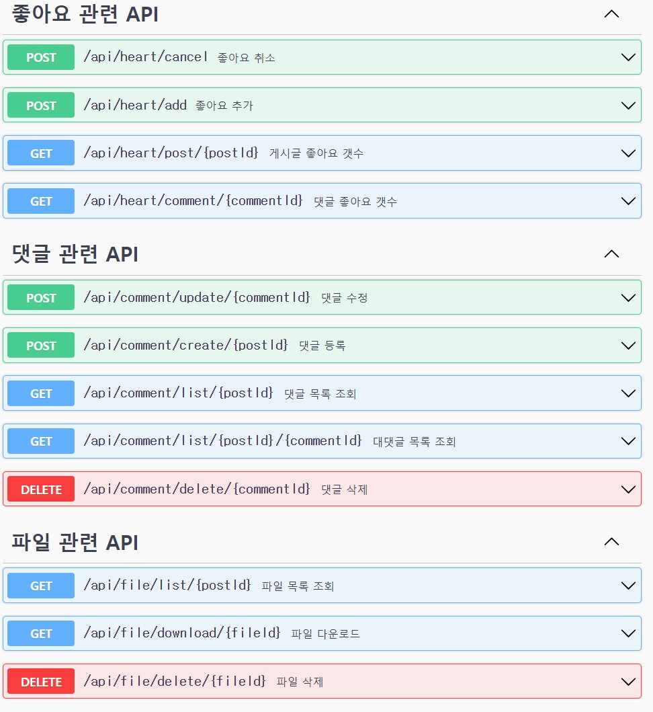
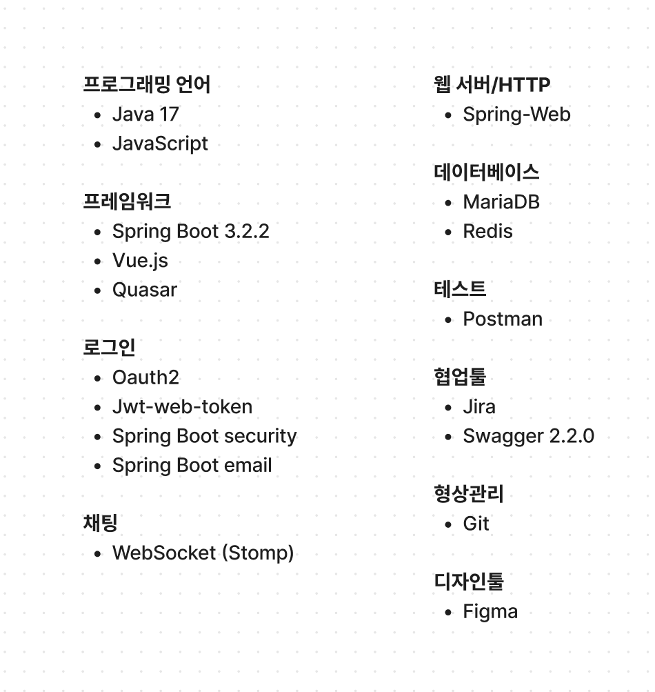
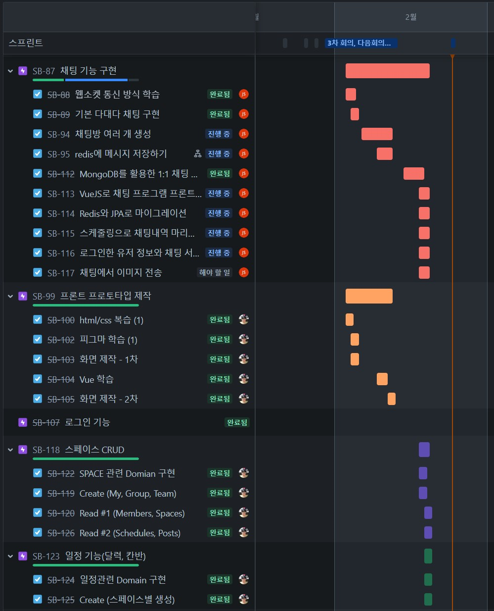

# 프로젝트명 : encore SPACE 

# 프로젝트 개요 : 엔코아 부트캠프홍보를 위해 수강생들의 활동 기록을 통합하여 관리할 수 있는 서비스

# 요구사항 정의서(기능명세)

# ERD 다이어그램

# 스웨거를 활용한 API설계

    
스페이스

    
스케쥴, 채팅룸

    
게시판 API

    
 회원

    
 좋아요, 댓글 파일

    
 CommonResponse 

# 중점기술명세

# 프로젝트 관리(지라)

    
 지라를 활용(2) 

    
 지라를 활용(2) 

# 개별 작업 결과물

- 📕 [SPACE](https://github.com/lifedesigner88/Space-BackEnd/blob/develop/docs/Space/README.md)
- 📙 [POST, 댓글, 좋아요](https://github.com/lifedesigner88/Space-BackEnd/tree/HHJ/Docs/docs/heejun_docs)
- 📗 [채팅 서비스](https://github.com/lifedesigner88/Space-BackEnd/tree/develop/docs/docs_jaeseok)
- 📘 [회원가입 및 로그인 서비스 및 프론트엔드](https://github.com/lifedesigner88/Space-BackEnd/tree/develop/docs/docs_GyeongNam)

