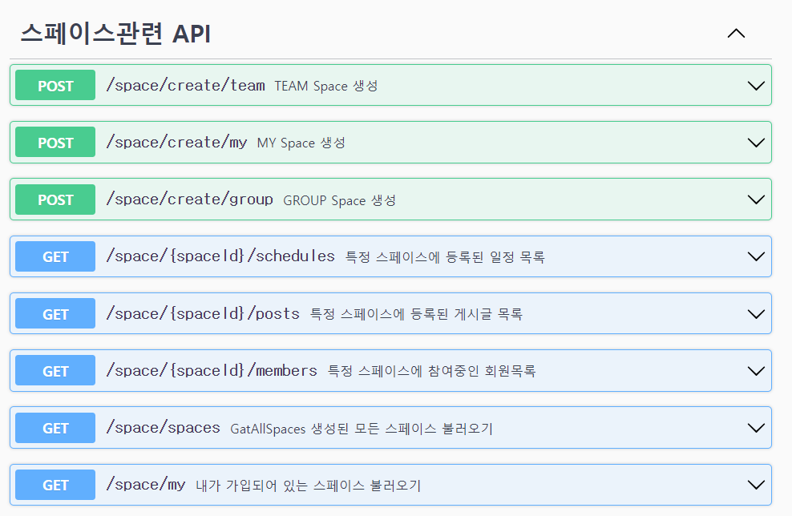
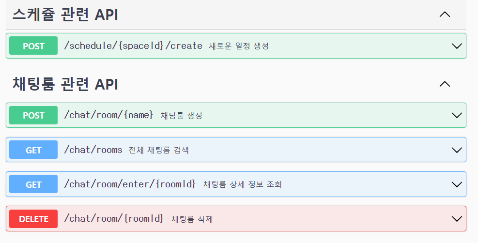
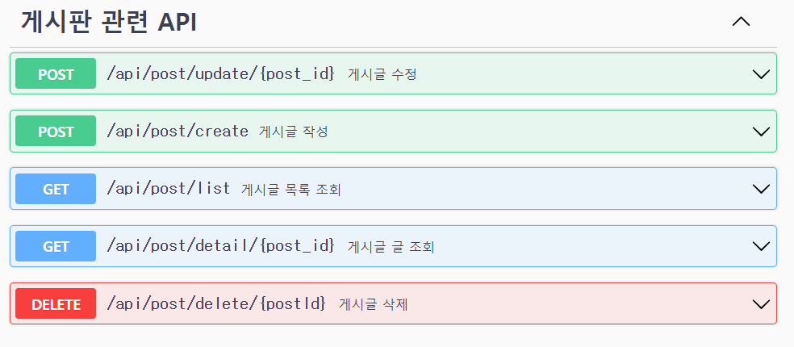
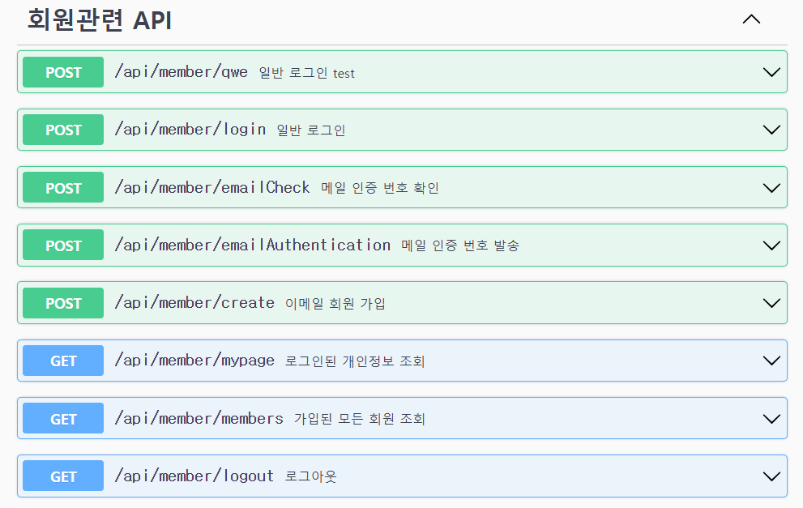
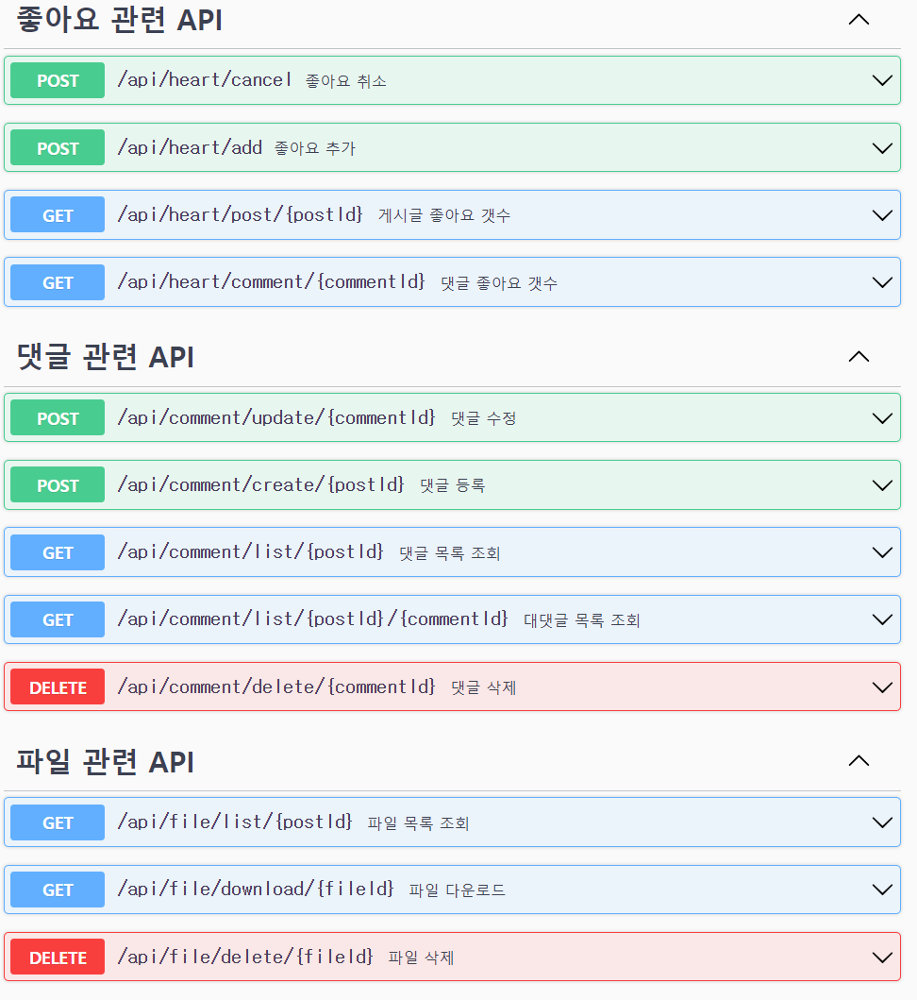

# 프로젝트명 : encore SPACE 

# 프로젝트 개요 : 엔코아 부트캠프홍보를 위해 수강생들의 활동 기록을 통합하여 관리할 수 있는 서비스

# 요구사항정의서(기능명세)

# ERD 다이어그램

# API설계

    
스페이스

    
스케쥴, 채팅룸

    
게시판 API

    
 회원

    
 조하요, 댓글 

# 중점기술명세

# 테스트

# 테스트 결과
